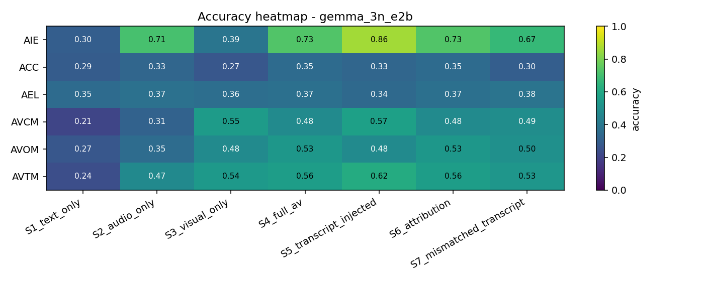

# Beyond Accuracy: Diagnosing Modality Attribution and Confidence Calibration in Video-LLMs

This repo extends the [AVUT benchmark](https://huggingface.co/datasets/tsinghua-ee/AVUTBenchmark) (Yang et al., EMNLP 2025) with three diagnostic axes that go beyond raw accuracy on audio-centric video QA:

1. **Modality Attribution Faithfulness (AFS)** — When a model reports it relied on audio, does ablating audio actually flip its answer? Measures self-report vs. counterfactual disagreement.
2. **Confidence Calibration under Ablation (ΔConf, ECE)** — Does the model's confidence drop when the signal-carrying modality is removed, or stay overconfident when "flying blind"?
3. **Lexical Override Rate (LOR)** — When the audio says one thing and an injected mismatched transcript says another, which one wins? A direct audio-vs-text trust probe.

Primary model: **Gemma-3n-E2B-IT** (this repo). Comparison anchor: **Qwen2.5-Omni-7B** (numbers from teammate's run at [jjwang8/639_avut](https://github.com/jjwang8/639_avut)).

---

## TL;DR

Run on **600 balanced samples** (100 per task across the 6 AVUT-Human task types) using a fixed seed, with `metrics.compute_*` verified bit-identical to the Qwen run.

**Headline accuracy (Gemma-3n-E2B-IT):**

| Stage | Overall accuracy | Note |
|---|---|---|
| S1 text-only baseline (Qwen2.5-1.5B) | 0.277 | Question + options only — confirms tasks are not text-soluble |
| S2 audio-only | 0.427 | Audio + question, no video frames |
| S3 visual-only | 0.431 | Silent video + question |
| S4 full audio-visual | **0.503** | Reference condition |
| S5 + matched ASR transcript | 0.533 | Transcript injection *helps* |
| S6 attribution follow-up | 0.503 | Same prompt as S4, then asks model to name the modality it used |
| S7 + mismatched transcript | 0.478 | Transcript from a different same-task video (lexical override probe) |

**Diagnostic findings:**

- **AFS = 0.494** overall (165 faithful / 169 confabulated of 334 falsifiable cases). The model's modality attribution is correct on a *coin flip*. Confabulation is concentrated on **AVOM (0.31), AVCM (0.35), AVTM (0.40)** — the cross-modal matching tasks. Pure-audio tasks **AIE (0.70), ACC (0.66), AEL (0.63)** are much more faithful.
- **LOR = 0.163.** When the model is right at S4 and you swap in a *contradictory* transcript, it abandons its audio-grounded answer 16% of the time. The remaining 84% stick with audio.
- **TIB = −0.030.** Transcript injection slightly *helps* on average — Gemma is not over-relying on transcripts. Per-task: AIE benefits the most (TIB = −0.13), AVOM is the only task where transcript hurts (TIB = +0.05).
- **ΔConf separates the modalities cleanly.** Removing audio drops confidence by **+3.3 pp** on average; removing visual drops by **−0.5 pp** (effectively flat). The model "knows" audio carries the signal, even when its answer is wrong.
- **ECE drops monotonically with information added:** S1 0.67 → S4 0.47 → S5 0.45.

**Cross-model comparison (overall accuracy by stage):**

| Stage | Gemma-3n-E2B-IT | Qwen2.5-Omni-7B (anchor) | Δ |
|---|---|---|---|
| S1 text-only | 0.277 | 0.289 | +0.012 |
| S2 audio-only | 0.427 | 0.499 | +0.072 |
| S3 visual-only | 0.431 | 0.495 | +0.064 |
| S4 full AV | 0.503 | 0.591 | +0.088 |
| S5 transcript-injected | 0.533 | 0.624 | +0.091 |
| S6 attribution | 0.503 | 0.591 | +0.088 |
| S7 mismatched transcript | 0.478 | — | — |
| S8 prosody | — | 0.574 | — |

Qwen2.5-Omni-7B is uniformly **+7-9 pp** better — consistent with its 3.5× parameter count — but the **same qualitative pattern** holds in both architectures: S4 > single-modality, transcript injection helps, S6 attribution accuracy ≈ S4. The diagnostic story (faithfulness, calibration, lexical override) is therefore not an artifact of one model.

### Accuracy heatmap (Gemma-3n-E2B-IT)



**Cross-model AFS by task:**

| Task | Gemma | Qwen-Omni | Reading |
|---|---|---|---|
| Audio Information Extraction (AIE) | 0.70 | 0.78 | Pure-audio task — both faithful |
| Audio Content Counting (ACC)        | 0.66 | 0.71 | Audio counting |
| Audio Event Location (AEL)          | 0.63 | 0.57 | Audio event timing — Gemma slightly more faithful |
| Audio OCR Matching (AVTM)           | 0.40 | 0.43 | Cross-modal text-in-image |
| Audio Character Matching (AVCM)     | 0.35 | 0.41 | Cross-modal speaker→face |
| Audio Object Matching (AVOM)        | 0.31 | 0.50 | **Biggest gap** — cross-modal sound→object |

The largest cross-model gap is on **AVOM** (Δ AFS = 0.19). The smaller model confabulates more on tasks that need joint audio+visual grounding.

---

## Pipeline

The 7 stages are designed as a single counterfactual lattice — every metric is computed by comparing two stages:

| Stage | Inputs given to the model |
|------:|:--|
| **S1** text-only      | Question + options (Qwen2.5-1.5B-Instruct baseline) |
| **S2** audio-only     | Audio (16 kHz mono, ≤30 s) + question |
| **S3** visual-only    | 8 sampled video frames + question (no audio) |
| **S4** full AV        | 8 frames + audio + question + verbalized confidence prompt |
| **S5** + transcript   | S4 inputs + Whisper-small transcript of *this* video |
| **S6** attribution    | S4 reasoning, then asks: "Which modality did you actually use?" |
| **S7** + mismatched transcript | S4 inputs + transcript from a *different* same-task video |

Stage names match the Qwen-Omni run at jjwang8/639_avut for cell-by-cell comparability. **S7 is novel to this run** — the lexical override probe.

## Reproduction

The whole pipeline runs from a Colab notebook, using Drive for persistent caches and HuggingFace for models + the AV-Human dataset.

```bash
git clone https://github.com/samadasyed/omnimodel-research.git
cd omnimodel-research
```

In Colab (A100 recommended, L4 works for Gemma but slower for Whisper):

1. **`notebooks/01_setup_and_download.ipynb`** — installs deps, mounts Drive, fetches `AV_Human_data.json`, downloads the 600 sampled videos directly from the HF dataset (no yt-dlp).
2. **`notebooks/02_preprocess.ipynb`** — extracts audio (`ffmpeg`, 16 kHz mono), creates silent video, runs Whisper-small, builds the mismatched-transcript pairing manifest.
3. **`notebooks/03_pilot.ipynb`** — 24-sample sanity check on Gemma; verifies frame sampler, audio loader, and prompt parsing before the long run.
4. **`notebooks/04_main_eval_gemma.ipynb`** — full 7-stage eval on Gemma-3n-E2B-IT (≈5 h on an A100). Resume-safe — if interrupted, restart and it skips already-saved `qa_id`s.
5. **`notebooks/05_main_eval_qwen.ipynb`** — same on Qwen2.5-Omni-7B (skipped here; anchor numbers come from teammate Jeff's run).
6. **`notebooks/06_analysis.ipynb`** — loads each model's per-stage JSON, computes all 9 metric files, fetches Jeff's published Qwen-Omni metrics for cross-model tables, renders the accuracy heatmap.

A gated HuggingFace token (`HF_TOKEN`) must be added to Colab Secrets (left sidebar → key icon) — Gemma-3n is gated, the dataset is public.

## Repo layout

```
notebooks/        Six numbered Colab notebooks; numbered by execution order
src/              Python utilities imported from notebooks
  data_utils.py        Annotation loader, balanced subsampling, HF video downloader
  model_utils.py       Gemma3nWrapper (primary), QwenOmniWrapper, TextOnlyModelWrapper
  prompts.py           Stage-specific prompts (Jeff's [ANSWER] X [CONFIDENCE] Y format)
  parse_utils.py       Progressive-fallback answer/confidence parser
  stages.py            STAGE_REGISTRY: which model each stage uses, dependencies
  metrics.py           AFS, LOR, TIB, ΔConf, ECE, point-biserial r, flip rates
  transcript_utils.py  Whisper helper, mismatched-pair builder
scripts/
  _build_notebooks.py  Generates all .ipynb files from a single source-of-truth
results/
  raw_predictions/gemma_3n_e2b/    Per-stage JSON of every prediction (qa_id keyed)
  metrics/gemma_3n_e2b/            9 metric JSONs (see below)
  figures/                         Accuracy heatmap PNG
paper/
  report.md         Class write-up (5 pages)
data/             Annotations + cached videos (gitignored)
```

## Metric files

Saved per model run under `results/metrics/<model>/`:

| File | Contents |
|---|---|
| `accuracy_per_task_per_stage.json` | Accuracy + n_correct + n_valid for every (task, stage) cell |
| `attribution_faithfulness.json` | AFS per task with faithful/confabulated/trivial/unparseable counts |
| `lexical_override_rate.json` | LOR per task with flipped/stayed counts (S4-correct samples only) |
| `transcript_injection_bias.json` | TIB per task with S4 vs S5 accuracies |
| `confidence_per_task_per_stage.json` | Mean verbalized confidence per cell |
| `confidence_drops.json` | ΔConf(audio_removal) and ΔConf(visual_removal) per task |
| `confidence_accuracy_correlation.json` | Point-biserial r between confidence and correctness |
| `ece_per_stage.json` | Expected Calibration Error per stage (10 bins) |
| `answer_flip_rates.json` | Stage-pair flip rates (remove_audio, remove_visual, add_transcript, mismatched_transcript, to_text_only) |

Numerical compatibility with the Qwen-Omni run is verified: feeding Jeff's raw predictions through `metrics.compute_*` reproduces his published metric JSONs bit-identical.

## Citation

This work builds on the AVUT benchmark:

```bibtex
@inproceedings{yang2025audio,
  title={Audio-centric Video Understanding Benchmark without Text Shortcut},
  author={Yang, Yudong and Zhuang, Jimin and Sun, Guangzhi and Tang, Changli and Li, Yixuan and Li, Peihan and Jiang, Yifan and Li, Wei and Ma, Zejun and Zhang, Chao},
  booktitle={EMNLP},
  year={2025}
}
```
